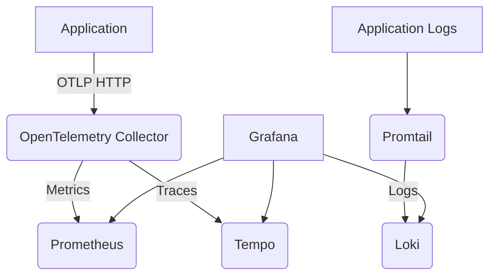

# OpenTelemetry Observability Stack

A complete observability solution using OpenTelemetry with logs, metrics, and traces (the "three pillars") visualized in Grafana.

## Overview

This project provides a ready-to-use observability stack that includes:
- **OpenTelemetry Collector** - Receives telemetry data via OTLP (port 4318)
- **Tempo** - Distributed tracing backend
- **Prometheus** - Metrics storage and querying
- **Loki** - Log aggregation system
- **Promtail** - Log shipper for Loki
- **Grafana** - Visualization platform for logs, metrics, and traces

The stack is pre-configured with a sample Go application dashboard and all necessary data source connections.

## Architecture



## Services

| Service | Port | Description |
|---------|------|-------------|
| Grafana | 3000 | Visualization UI (admin:admin) |
| OTLP Receiver | 4318 | OpenTelemetry Collector HTTP receiver |
| Prometheus | Internal | Metrics storage |
| Tempo | Internal | Distributed tracing backend |
| Loki | Internal | Log aggregation system |
| Promtail | Internal | Log shipper |

## Quick Start

1. Start the stack:
   ```bash
   docker-compose up -d
   ```

2. Access Grafana at http://localhost:3000 (admin:admin)

3. Send telemetry data to the OTLP receiver at http://localhost:4318

## Configuration

### OpenTelemetry Collector
- Config file: `config/otel-collector-config.yaml`
- Receives OTLP data on port 4318 (HTTP)
- Exports metrics to Prometheus (port 8889)
- Exports traces to Tempo (port 4317)

### Tempo (Tracing)
- Config file: `tempo/tempo.yaml`
- Stores traces locally in `/var/tempo`
- Retention: 24 hours

### Prometheus (Metrics)
- Config file: `prometheus/prometheus.yml`
- Scrapes metrics from OpenTelemetry Collector
- Retention: 200 hours

### Loki (Logs)
- Config file: `loki/loki-config.yaml`
- Stores logs in filesystem
- Receives logs from Promtail

### Promtail (Log Shipping)
- Config file: `loki/promtail.yaml`
- Ships Docker container logs to Loki
- Extracts structured fields from JSON logs

### Grafana
- Data sources configured for Prometheus, Tempo, and Loki
- Pre-provisioned dashboard for Go application observability
- Credentials: admin:admin

## Grafana Dashboards

The stack includes a pre-provisioned dashboard for Go application observability with panels for:
- Request rate and error rate
- Latency metrics (p50, p90, p95, p99)
- Runtime metrics (goroutines, GC pauses, heap allocation)
- Request duration histograms
- Error tracking by route

## Data Flow

1. Applications send telemetry data (logs, metrics, traces) via OTLP to the OpenTelemetry Collector
2. Collector processes and exports data to the appropriate backends:
   - Metrics → Prometheus
   - Traces → Tempo
   - Logs → Loki (via Promtail for container logs)
3. Grafana queries data from all backends for visualization

## Customization

### Adding Services
To add new services, modify the `docker-compose.yml` file and update the relevant configuration files.

### Modifying Dashboards
Edit `grafana/provisioning/dashboards/app-observability.json` or add new dashboard files to the same directory.

### Changing Retention
Update retention settings in the respective configuration files:
- Tempo: `tempo/tempo.yaml` (`block_retention`)
- Prometheus: `prometheus/prometheus.yml` (`storage.tsdb.retention.time`)

## Troubleshooting

### Health Checks
All services have health checks configured. Check service status with:
```bash
docker-compose ps
```

### Logs
View logs for any service:
```bash
docker-compose logs <service-name>
```

### Common Issues
1. If Grafana can't connect to data sources, ensure all services are running:
   ```bash
   docker-compose ps
   ```

2. If you're not seeing any data, verify your application is sending data to the OTLP receiver:
   ```bash
   curl -X POST http://localhost:4318/v1/traces -H "Content-Type: application/json" -d '{}'
   ```

## Ports Reference

| External Port | Service | Purpose |
|---------------|---------|---------|
| 3000 | Grafana | Web UI |
| 4318 | OTLP Receiver | Telemetry ingestion |
| 9080 | Promtail | Health checks |

Internal ports (not exposed):
- Prometheus: 9090
- Tempo: 3200
- Loki: 3100

## License

This project is provided as-is for demonstration and testing purposes.