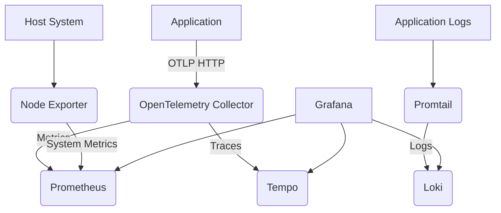

# OpenTelemetry Observability Stack

A complete observability solution using OpenTelemetry with logs, metrics, and traces (the "three pillars") visualized in
Grafana.

## Overview

This project provides a ready-to-use observability stack that includes:

- **OpenTelemetry Collector** - Receives telemetry data via OTLP (port 4318)
- **Tempo** - Distributed tracing backend
- **Prometheus** - Metrics storage and querying
- **Loki** - Log aggregation system
- **Promtail** - Log shipper for Loki
- **Node Exporter** - System metrics collector for host monitoring
- **Grafana** - Visualization platform for logs, metrics, and traces
- **Sample Go Application** - Instrumented application demonstrating OpenTelemetry usage

The stack is pre-configured with a sample Go application dashboard and all necessary data source connections.

## Architecture



## Services

| Service       | Port     | Description                           |
|---------------|----------|---------------------------------------|
| Grafana       | 3000     | Visualization UI (admin:admin)        |
| OTLP Receiver | 4318     | OpenTelemetry Collector HTTP receiver |
| Node Exporter | 9100     | System metrics exporter               |
| Prometheus    | Internal | Metrics storage                       |
| Tempo         | Internal | Distributed tracing backend           |
| Loki          | Internal | Log aggregation system                |
| Promtail      | Internal | Log shipper                           |

## Quick Start

1. Start the stack:
   ```bash
   docker compose up -d
   ```

2. Access Grafana at http://localhost:3000 (admin:admin)

3. Send telemetry data to the OTLP receiver at http://localhost:4318

4. Run the sample Go application:
   ```bash
   cd go-app
   go run main.go
   ```

5. Test the application endpoints:
   ```bash
   cd go-app
   ./test_endpoints.sh
   ```

## Sample Go Application

The repository includes a sample Go application (`go-app`) that demonstrates how to instrument an application with OpenTelemetry. The application features:

### Features
- RESTful API for user management (CRUD operations)
- Complete OpenTelemetry instrumentation for traces, metrics, and logs
- Graceful shutdown handling
- Configuration management with environment variables
- In-memory storage for demonstration purposes

### API Endpoints
The application exposes the following endpoints:

| Method | Endpoint    | Description              |
|--------|-------------|--------------------------|
| GET    | /           | Root endpoint            |
| GET    | /health     | Health check             |
| GET    | /users      | List all users           |
| POST   | /users      | Create a new user        |
| GET    | /users/{id} | Get user by ID           |
| PUT    | /users/{id} | Update user by ID        |
| DELETE | /users/{id} | Delete user by ID        |

### Running the Application
1. Navigate to the `go-app` directory:
   ```bash
   cd go-app
   ```

2. Copy the example environment file and modify as needed:
   ```bash
   cp .env.example .env
   ```

3. Run the application:
   ```bash
   go run main.go
   ```

The application will start on port 8080 by default.

### Testing the Application
Use the provided test script to verify the application is working:
```bash
./test_endpoints.sh
```

Or manually test with curl:
```bash
# Create a user
curl -X POST http://localhost:8080/users \
  -H "Content-Type: application/json" \
  -d '{"name":"Alice","email":"alice@example.com"}'

# List users
curl http://localhost:8080/users
```

### OpenTelemetry Instrumentation
The application is fully instrumented with OpenTelemetry:

- **Tracing**: Automatic and manual span creation for all HTTP requests and business operations
- **Metrics**: Custom metrics for application performance monitoring
- **Logging**: Structured logging with trace context propagation

The application sends telemetry data to the OpenTelemetry Collector at `localhost:4318`.

## Configuration

### OpenTelemetry Collector

- Config file: `config/otel-collector-config.yaml`
- Receives OTLP data on port 4318 (HTTP)
- Exports metrics to Prometheus (port 8889)
- Exports traces to Tempo (port 4317)
- Note: Docker healthcheck is disabled due to distroless image limitations; internal health_check extension is still
  active

### Tempo (Tracing)

- Config file: `tempo/tempo.yaml`
- Stores traces locally in `/var/tempo`
- Retention: 24 hours

### Prometheus (Metrics)

- Config file: `prometheus/prometheus.yml`
- Scrapes metrics from OpenTelemetry Collector and Node Exporter
- Retention: 200 hours

### Loki (Logs)

- Config file: `loki/loki-config.yaml`
- Stores logs in filesystem
- Receives logs from Promtail

### Promtail (Log Shipping)

- Config file: `loki/promtail.yaml`
- Ships Docker container logs to Loki
- Extracts structured fields from JSON logs

### Node Exporter (System Metrics)

- Collects system-level metrics from the host
- Exports metrics on port 9100
- Monitors CPU, memory, disk, network, and filesystem metrics
- Scraped by Prometheus for host monitoring

### Grafana

- Data sources configured for Prometheus, Tempo, and Loki
- Pre-provisioned dashboard for Go application observability
- Credentials: admin:admin

## Grafana Dashboards

The stack includes a pre-provisioned dashboard for Go application observability with panels for:

- Request rate and error rate
- Latency metrics (p50, p90, p95, p99)
- Runtime metrics (goroutines, GC pauses, heap allocation)
- Request duration histograms
- Error tracking by route

## Data Flow

1. Applications send telemetry data (logs, metrics, traces) via OTLP to the OpenTelemetry Collector
2. Node Exporter collects system-level metrics from the host system
3. Collector processes and exports data to the appropriate backends:
    - Metrics → Prometheus
    - Traces → Tempo
    - Logs → Loki (via Promtail for container logs)
4. Prometheus scrapes metrics from both the Collector and Node Exporter
5. Grafana queries data from all backends for visualization

## Customization

### Adding Services

To add new services, modify the `docker-compose.yml` file and update the relevant configuration files.

### Modifying Dashboards

Edit `grafana/provisioning/dashboards/app-observability.json` or add new dashboard files to the same directory.

### Changing Retention

Update retention settings in the respective configuration files:

- Tempo: `tempo/tempo.yaml` (`block_retention`)
- Prometheus: `prometheus/prometheus.yml` (`storage.tsdb.retention.time`)

## Troubleshooting

### Health Checks

All services have health checks configured. Check service status with:

```bash
docker compose ps
```

### Logs

View logs for any service:

```bash
docker compose logs <service-name>
```

### Common Issues

1. If Grafana can't connect to data sources, ensure all services are running:
   ```bash
   docker compose ps
   ```

2. If you're not seeing any data, verify your application is sending data to the OTLP receiver:
   ```bash
   curl -X POST http://localhost:4318/v1/traces -H "Content-Type: application/json" -d '{}'
   ```

## Ports Reference

| External Port | Service              | Purpose             |
|---------------|----------------------|---------------------|
| 3000          | Grafana              | Web UI              |
| 4317          | OTLP Receiver (GRPC) | Telemetry ingestion |
| 4318          | OTLP Receiver (HTTP) | Telemetry ingestion |

Internal ports (not exposed):

- Prometheus: 9090
- Tempo: 3200
- Loki: 3100
- Node Exporter: 9100

## License

This project is provided as-is for demonstration and testing purposes.